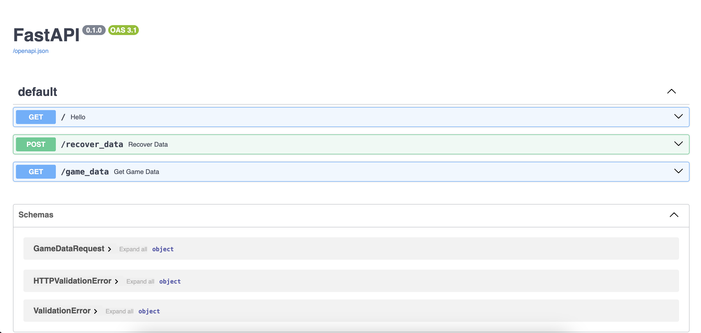

# API Snake Game

[](LICENSE)

Snake Game API using FastAPI which provides a simple and powerful interface to retrieve game data from players.  

## Description  


My API offers the possibility of integrating into game monitoring tools in order to understand the players' playing methods, thus making it possible to adjust the challenge to the difficulties they may have encountered during their game.  



## Table of Contents

- [Getting Started](#Getting-Started)
- [Launch Application](#Launch-Application)
- [Contributing](#Contributing)
- [License](#License)  

## Getting Started  

```bash
git clone https://github.com/HaDock404/api-game-snake.git
cd api-game-snake
pip install -r ./packages/requirements.txt
``` 
or you can create a container 

```bash
git clone https://github.com/HaDock404/api-game-snake.git
cd api-game-snake
docker build -t your_name/dockerimg:v0 .
sudo docker run -dp 8081:8000 -ti --name Container your_name/dockerimg:v0
``` 

## Launch Application   

```bash
uvicorn api:app -—reload
```  

## Contributing

Pull requests are welcome. For major changes, please open an issue first
to discuss what you would like to change.

Please make sure to update tests as appropriate.

## License  

This project is licensed under the MIT License - see the [LICENSE](./LICENSE) file for details.